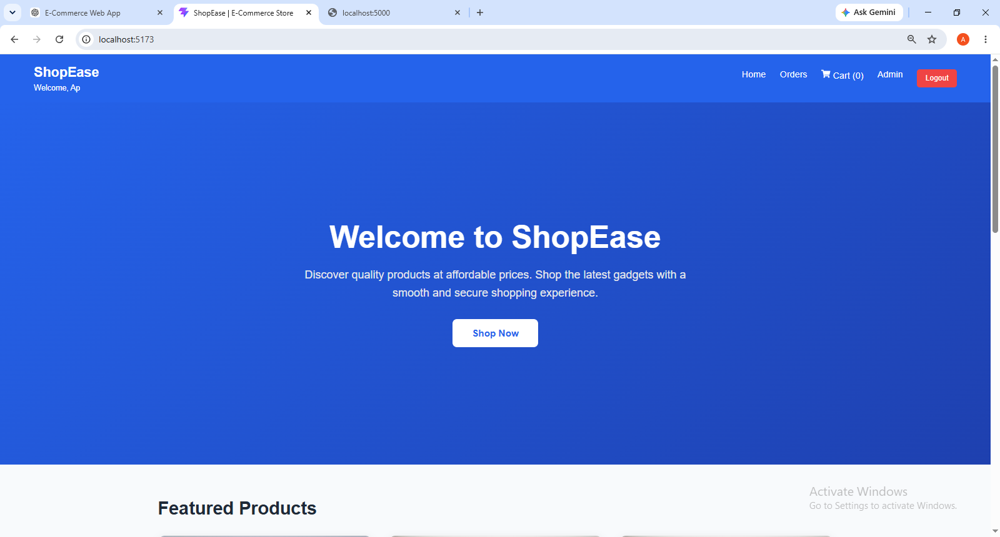
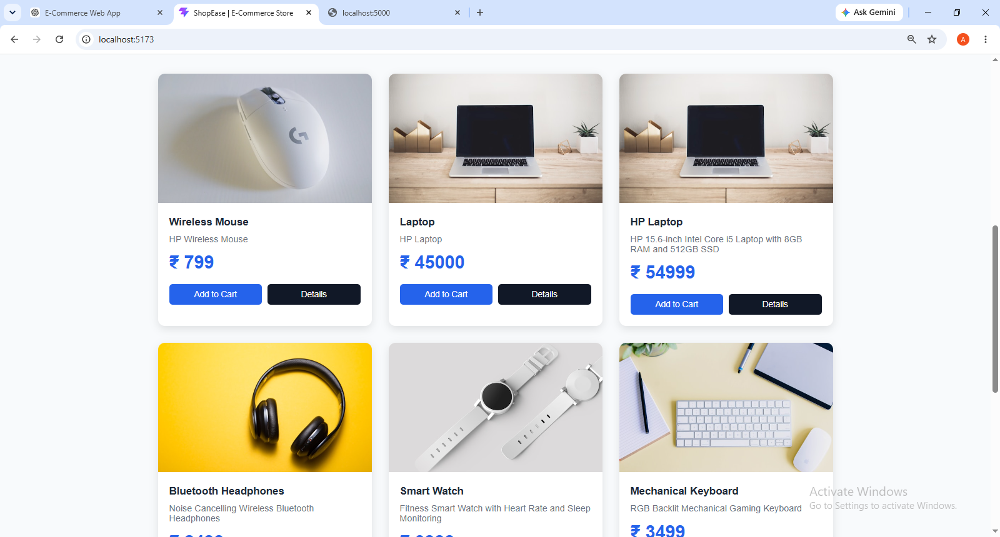
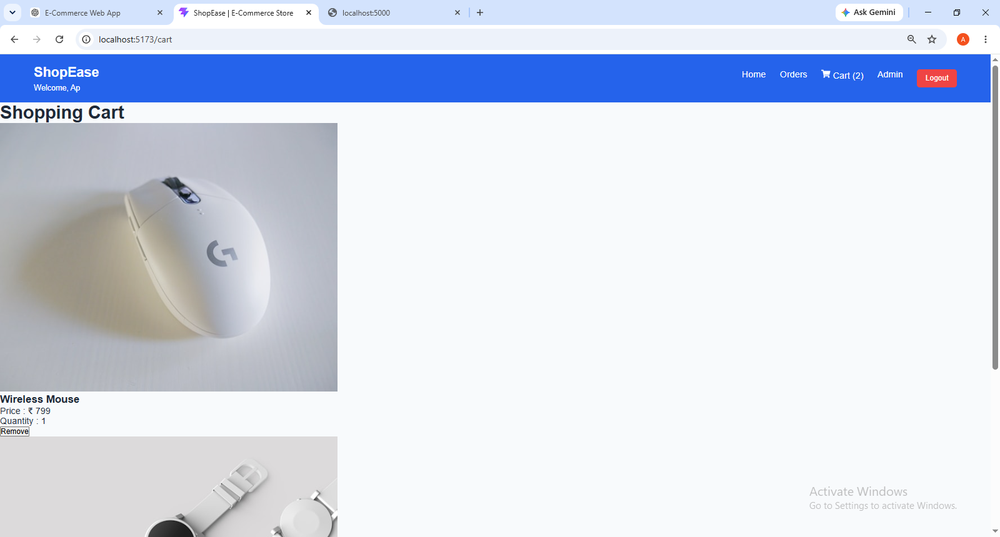
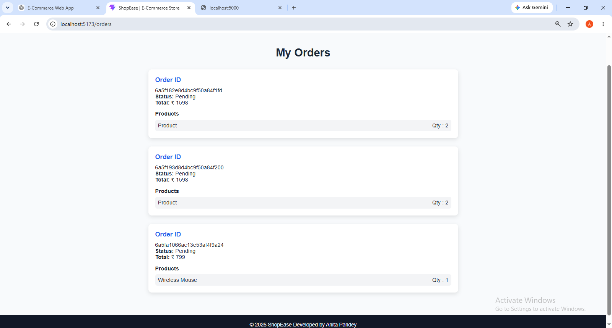
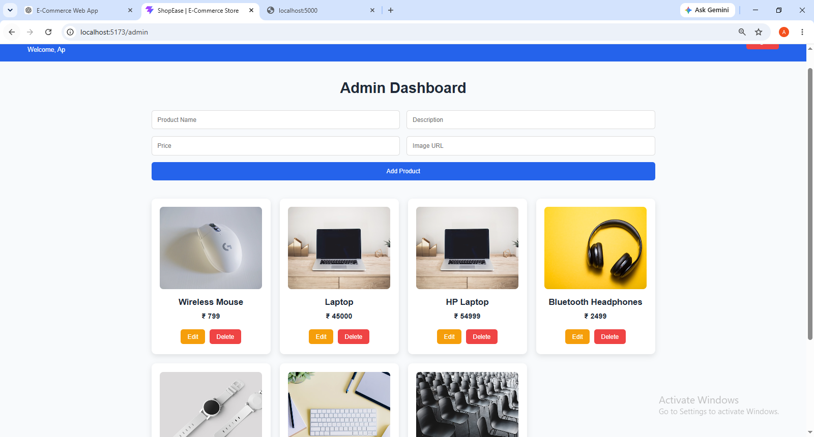

# 🛒 ShopEase - MERN E-Commerce Web Application

A full-stack E-Commerce Web Application built using the MERN Stack (MongoDB, Express.js, React.js, Node.js). The application allows users to browse products, manage their shopping cart, place orders, and enables administrators to manage products through a dedicated dashboard.

---

## 🚀 Live Features

### 👤 User Features
- User Registration & Login
- JWT Authentication
- Browse Product Catalog
- View Product Details
- Add Products to Cart
- Update Cart Quantity
- Checkout & Place Orders
- View Order History
- Logout

### 👨‍💼 Admin Features
- Admin Dashboard
- Add Products
- Update Products
- Delete Products
- Product Management

---

## 🛠 Tech Stack

### Frontend
- React.js
- React Router DOM
- Axios
- CSS3
- React Icons

### Backend
- Node.js
- Express.js
- MongoDB Atlas
- Mongoose
- JWT Authentication
- bcryptjs

---

## 📂 Project Structure

```
Ecommerce/
│
├── client/
│   ├── src/
│   ├── public/
│   └── package.json
│
├── server/
│   ├── controllers/
│   ├── middleware/
│   ├── models/
│   ├── routes/
│   ├── config/
│   └── server.js
│
└── README.md
```

---

## ✨ Features Implemented

- ✅ Authentication
- ✅ Product Management (CRUD)
- ✅ Shopping Cart
- ✅ Checkout System
- ✅ Order Tracking
- ✅ Admin Dashboard
- ✅ MongoDB Database Integration
- ✅ Responsive User Interface

---

## ⚙️ Installation

### Clone Repository

```bash
git clone https://github.com/Anitapandey01/Ecommerce.git
```

### Backend

```bash
cd server
npm install
npm run dev
```

### Frontend

```bash
cd client
npm install
npm run dev
```

---

## 🌐 API Endpoints

### Authentication

| Method | Endpoint |
|---------|----------|
| POST | /api/auth/register |
| POST | /api/auth/login |

### Products

| Method | Endpoint |
|---------|----------|
| GET | /api/products |
| POST | /api/products |
| PUT | /api/products/:id |
| DELETE | /api/products/:id |

### Orders

| Method | Endpoint |
|---------|----------|
| GET | /api/orders |
| POST | /api/orders |

---

## 🗄 Database

MongoDB Atlas is used for storing:

- Users
- Products
- Orders

---

## 📸 Screenshots

> Add screenshots here after completing the project.

### 🏠 Home Page





### 🛒 Shopping Cart



### 📦 Orders



### 👨‍💼 Admin Dashboard



---

## 🎯 Future Improvements

- Online Payment Integration
- Search Products
- Product Categories
- Wishlist
- User Profile
- Persistent Cart
- Image Upload with Cloudinary
- Order Status Updates

---

## 👩‍💻 Developed By

**Anita Pandey**

B.Tech Computer Science & Engineering

---

⭐ If you like this project, don't forget to star the repository.